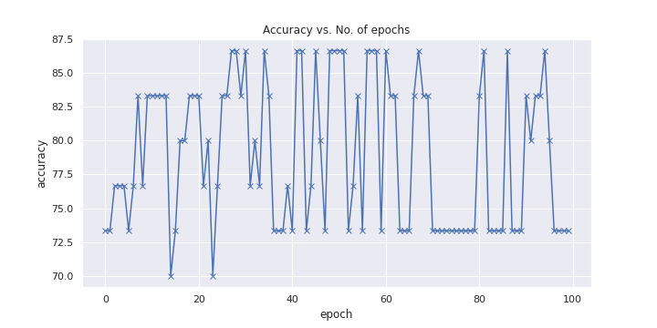

# HeartAttack-Predictions

Heart Attack Prediction algorithm using concepts of Deep Learning and Machine Learning to determine whether there is an possibility that a person can have a heat attack or not. The model was using Linear Regression via PyTorch. And the plots were created using python and Tableau. 

The Dataset was obtained from kaggle and can be found [here](https://www.kaggle.com/rashikrahmanpritom/heart-attack-analysis-prediction-dataset). The Dataset consists of over 300 rows of data.

# Model Results 
After training our model has reached 86% validation accuracy and 0.279% validation loss. The plots can be observed below.

## Model Accuracy

## Model Losses 

